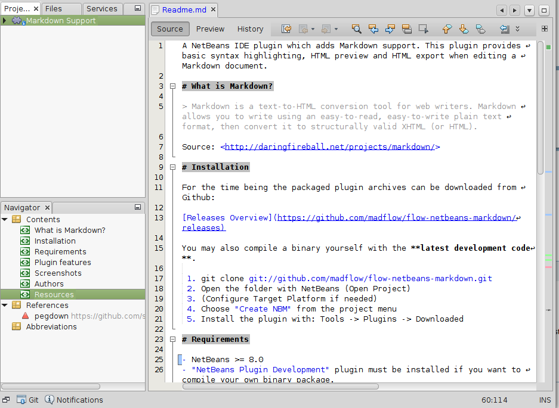
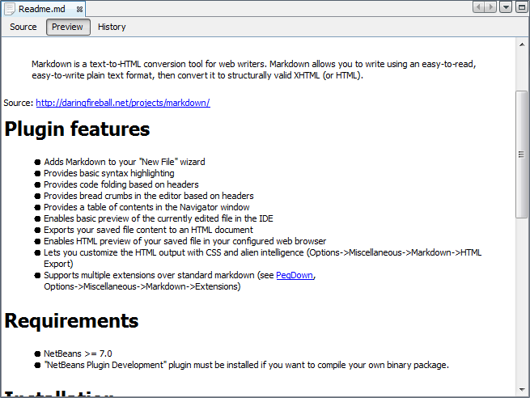

A NetBeans IDE plugin which adds Markdown support. This plugin provides basic syntax highlighting, HTML preview and HTML export when editing a Markdown document.

# What is Markdown?

> Markdown is a text-to-HTML conversion tool for web writers. Markdown allows you to write using an easy-to-read, easy-to-write plain text format, then convert it to structurally valid XHTML (or HTML).

Source: <http://daringfireball.net/projects/markdown/>

# Installation

If you just want Markdown-Support - you can **download a pre-packaged release**:

 - https://github.com/madflow/flow-netbeans-markdown/releases (list of all releases)
 - https://github.com/madflow/flow-netbeans-markdown/releases/download/2.0/flow-netbeans-markdown.nbm (**note:** version 2.0)
 
Install the plugin with: `Tools -> Plugins -> Downloaded`

You may also compile a binary yourself with the **latest development code**.

 1. git clone git://github.com/madflow/flow-netbeans-markdown.git
 2. Open the folder with NetBeans (Open Project)
 3. (Configure Target Platform if needed)
 4. Choose "Create NBM" from the project menu
 5. Install the plugin with: Tools -> Plugins -> Downloaded

# Requirements

- NetBeans >= 8.0
- "NetBeans Plugin Development" plugin must be installed if you want to compile your own binary package.

# Plugin features

- Adds Markdown to your "New File" wizard
- Provides basic syntax highlighting
- Provides code folding based on headers
- Provides bread crumbs in the editor based on headers
- Provides a table of contents in the Navigator window
- Enables full fledged preview in the editor window
- Exports your saved file content to an HTML document
- Enables HTML preview of your saved file in your configured web browser
- Lets you customize the HTML output with CSS and alien intelligence (Options->Miscellaneous->Markdown->HTML Export)
- Supports multiple extensions over standard markdown (see [PegDown][], Options->Miscellaneous->Markdown->Extensions)
- Supports auto operations(additoin and removal) for lists (Options->Miscellaneous->Markdown->Miscellaneous)

# Screenshots

***

# Authors

- Florian Reiss <https://github.com/madflow>
- junichi11 <https://github.com/junichi11>
- Holger Stenger <https://github.com/stengerh>
- Radosław Kowalewski <https://github.com/srsbiz>

Contributions are always welcome and greatly appreciated!

# Resources

- [PegDown][] : A pure-Java Markdown processor based on a parboiled PEG parser supporting a number of extensions.
- http://daringfireball.net/projects/markdown/ : Home of the Markdown (Basics, Syntax)
- http://openiconlibrary.sourceforge.net/ : Icons

[pegdown]: https://github.com/sirthias/pegdown
